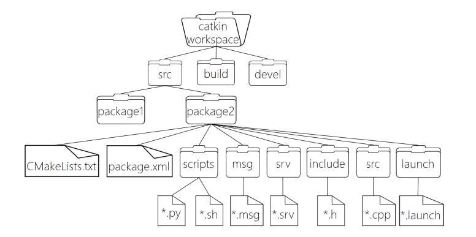
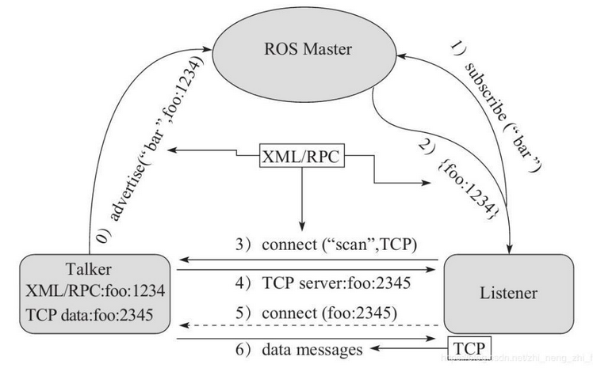
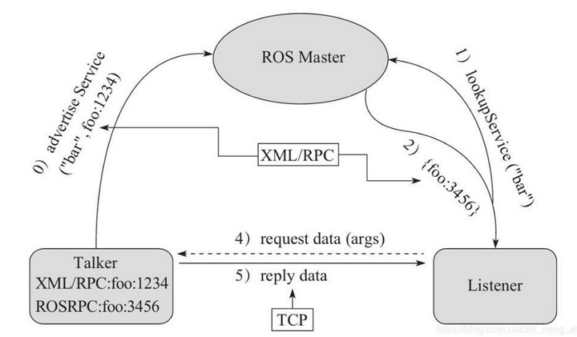
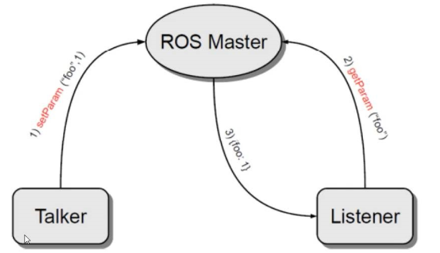

# learn_ros

> 本教程来自 [传送门](http://www.autolabor.com.cn/book/ROSTutorials/chapter1/15-ben-zhang-xiao-jie.html)

ROS全称Robot Operating System(机器人操作系统)

## ROS 架构

### 设计者角度

ROS = Plumbing + Tools + Capabilities + Ecosystem

- Plumbing: 通讯机制(实现ROS不同节点之间的交互)
- Tools :工具软件包(ROS中的开发和调试工具)
- Capabilities :机器人高层技能(ROS中某些功能的集合，比如:导航)
- Ecosystem:机器人生态系统(跨地域、跨软件与硬件的ROS联盟)

### 系统架构

- OS 层，也即经典意义的操作系统， ROS 只是元操作系统，需要依托真正意义的操作系统
- 中间层， 是 ROS 封装的关于机器人开发的中间件，比如:
  - 基于 TCP/UDP 继续封装的 TCPROS/UDPROS 通信系统
  - 用于进程间通信 Nodelet，为数据的实时性传输提供支持
  - 另外，还提供了大量的机器人开发实现库，如：数据类型定义、坐标变换、运动控制....
- 应用层， 功能包，以及功能包内的节点，比如: master、turtlesim的控制与运动节点...

## ROS 文件系统

  

### 文件系统相关命令

1. 增

    ```bash
    catkin_create_pkg 自定义包名 依赖包 === 创建新的ROS功能包
    sudo apt install xxx === 安装 ROS功能包
    ```

2. 删

    ```bash
    sudo apt purge xxx ==== 删除某个功能包
    ```

3. 查

    ```bash
    rospack list === 列出所有功能包
    rospack find 包名 === 查找某个功能包是否存在，如果存在返回安装路径
    roscd 包名 === 进入某个功能包
    rosls 包名 === 列出某个包下的文件
    apt search xxx === 搜索某个功能包
    ```

4. 改

    ```bash
    rosed 包名 文件名 === 修改功能包文件
    ```

5. 执行

    ```bash
    roscore
    roscore -p xxx
    rosrun 包名 可执行文件名 === 运行指定的ROS节点
    roslaunch 包名 launch文件名 === 执行某个包下的 launch 文件
    ```

    roscore === 是 ROS 的系统先决条件节点和程序的集合， 必须运行 roscore 才能使 ROS 节点进行通信。

    roscore 将启动:
    - ros master
    - ros 参数服务器
    - rosout 日志节点

## ROS 计算图

```bash
rqt_graph
rosrun rqt_graph rqt_graph
```

## launch 文件

roslaunch 命令不能保证按照 node 的声明顺序来启动节点(节点的启动是多进程的)

[laucn文件标签](http://www.autolabor.com.cn/book/ROSTutorials/5/45-rosjie-dianguan-li-launch-wen-jian/412-launchwen-jian-biao-qian-zhi-node.html)

**代码实现**：hello_world/launch

## ROS 通信机制

为了解耦合，在ROS中每一个功能点都是一个单独的进程，每一个进程都是独立运行的。更确切的讲，ROS是进程（也称为Nodes）的分布式框架。

OS 中的基本通信机制主要有如下三种实现策略:

- 话题通信(发布订阅模式)
- 服务通信(请求响应模式)
- 参数服务器(参数共享模式)
- Action 通信
- 动态参数

### 话题通信

**概念**：以发布订阅的方式实现不同节点之间数据交互的通信模式。

**作用**：用于不断更新的、少逻辑处理的数据传输场景。

**理论模型**
  

**代码实现**：demo02_talker_listener

### 自定义msg

**功能**：创建自定义消息

**流程**：

1. 按照固定格式创建 msg 文件
2. 编辑配置文件
3. 编译生成可以被 Python 或 C++ 调用的中间文件

**代码实现**：demo02_talker_listener/msg

话题通信代码实现：demo02_talker_listener

### 服务通信

**概念**：以请求响应的方式实现不同节点之间数据交互的通信模式

**作用**：用于偶然的、对时时性有要求、有一定逻辑处理需求的数据传输场景

**理论模型**
  

**代码实现**：demo03_server_client

### 参数服务器

**概念**：以共享的方式实现不同节点之间数据交互的通信模式。

**作用**：存储一些多节点共享的数据，类似于全局变量。

**理论模型**
  

**代码实现**：demo04_param

### Action 通信

**代码实现**: demo24_action

### 动态参数

**代码实现**: demo25_dynamic_reconfigure

## 常用命令

rosnode : 操作节点

rostopic : 操作话题

rosservice : 操作服务

rosmsg : 操作msg消息

rossrv : 操作srv消息

rosparam : 操作参数

代码实现：

demo05_control 控制乌龟做圆周运动

demo06_get_pose 得到乌龟的实时姿势

demo07_spawn_turtle 生产乌龟

demo08_set_backgroud 修改turtlesim乌龟显示节点窗体的背景色

demo09_time ROS 时间api的使用

demo10_log  ROS log api的使用 ROS 如何进行调试

demo11_head ROS 头文件，源文件也是可执行文件的使用方法，以及 python 如何引入自定义模块

demo11_use_head ROS 头文件，源文件的使用方法

## 元功能包

MetaPackage是Linux的一个文件管理系统的概念。是ROS中的一个虚包，里面没有实质性的内容，但是它依赖了其他的软件包，通过这种方法可以把其他包组合起来，我们可以认为它是一本书的目录索引，告诉我们这个包集合中有哪些子包，并且该去哪里下载。

代码实现：

demo12_meta_package

## ROS 运行管理

功能包重名时，会按照 ROS_PACKAGE_PATH 查找，配置在前的会优先执行。
ROS_PACKAGE_PATH 中的值，和 .bashrc 的配置顺序相反--->后配置的优先级更高

## ROS 节点名称重名

代码实现：

demo13_duplicate_node

## ROS 话题节点重名

全局(参数名称直接参考ROS系统，与节点命名空间平级)

相对(参数名称参考的是节点的命名空间，与节点名称平级)

私有(参数名称参考节点名称，是节点名称的子级)

代码实现：

demo14_duplicate_topic

## TF 坐标变换

代码实现：

demo16_tf(静态坐标变换)

demo17_tf_turtle(动态坐标变换)

demo18_multi_transformation(多坐标变换)

坐标系关系查看

```bash
rosrun tf2_tools view_frames.py
evince frames.pdf
```

demo19_turtle_follow

## rqt 工具箱

1. rqt_graph
2. rosbag
    rosbag本质也是ros的节点，当录制时，rosbag是一个订阅节点，可以订阅话题消息并将订阅到的数据写入磁盘文件；当重放时，rosbag是一个发布节点，可以读取磁盘文件，发布文件中的话题消息。
3. rqt_console
4. rqt_plot
5. rqt_bag

## 机器人系统仿真

仿真实现涉及的内容主要有三:对机器人建模(URDF)、创建仿真环境(Gazebo)以及感知环境(Rviz)等系统性实现

[相关属性](http://www.autolabor.com.cn/book/ROSTutorials/di-6-zhang-ji-qi-ren-xi-tong-fang-zhen/62-fang-zhen-urdf-ji-cheng-rviz/624-urdfyu-fa-xiang-jie-02-link.html)

代码实现：

demo21_urdf_rviz
(URDF xacro arbotix)

## 全局地图

SLAM： 机器人在未知环境中从一个未知位置开始移动,在移动过程中根据位置估计和地图进行自身定位，同时在自身定位的基础上建造增量式地图，以绘制出外部环境的完全地图。

## pluginlib

**代码实现**：demo26_pluginlib

## nodelet

**代码实现**：demo27_nodelet

## 问题

1. 坐标变换公式
2. ROS 多线程，订阅多个话题等需求
