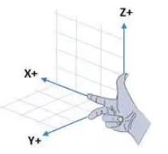

# learn_ros

> 本教程来自 [传送门](http://www.autolabor.com.cn/book/ROSTutorials/chapter1/15-ben-zhang-xiao-jie.html)

ROS全称Robot Operating System(机器人操作系统)

## ROS 架构

### 设计者角度

ROS = Plumbing + Tools + Capabilities + Ecosystem

- Plumbing: 通讯机制(实现ROS不同节点之间的交互)
- Tools :工具软件包(ROS中的开发和调试工具)
- Capabilities :机器人高层技能(ROS中某些功能的集合，比如:导航)
- Ecosystem:机器人生态系统(跨地域、跨软件与硬件的ROS联盟)

### 系统架构

- OS 层，也即经典意义的操作系统， ROS 只是元操作系统，需要依托真正意义的操作系统
- 中间层， 是 ROS 封装的关于机器人开发的中间件，比如:
  - 基于 TCP/UDP 继续封装的 TCPROS/UDPROS 通信系统
  - 用于进程间通信 Nodelet，为数据的实时性传输提供支持
  - 另外，还提供了大量的机器人开发实现库，如：数据类型定义、坐标变换、运动控制....
- 应用层， 功能包，以及功能包内的节点，比如: master、turtlesim的控制与运动节点...

## ROS 文件系统

  

### 文件系统相关命令

1. 增

    ```bash
    catkin_create_pkg 自定义包名 依赖包 === 创建新的ROS功能包
    sudo apt install xxx === 安装 ROS功能包
    ```

2. 删

    ```bash
    sudo apt purge xxx ==== 删除某个功能包
    ```

3. 查

    ```bash
    rospack list === 列出所有功能包
    rospack find 包名 === 查找某个功能包是否存在，如果存在返回安装路径
    roscd 包名 === 进入某个功能包
    rosls 包名 === 列出某个包下的文件
    apt search xxx === 搜索某个功能包
    ```

4. 改

    ```bash
    rosed 包名 文件名 === 修改功能包文件
    ```

5. 执行

    ```bash
    roscore
    roscore -p xxx
    rosrun 包名 可执行文件名 === 运行指定的ROS节点
    roslaunch 包名 launch文件名 === 执行某个包下的 launch 文件
    ```

    roscore === 是 ROS 的系统先决条件节点和程序的集合， 必须运行 roscore 才能使 ROS 节点进行通信。

    roscore 将启动:
    - ros master
    - ros 参数服务器
    - rosout 日志节点

## ROS 计算图

```bash
rqt_graph
rosrun rqt_graph rqt_graph
```

## HelloWorld 实现

### cpp 实现

1. 先创建一个工作空间

    ```bash
    mkdir -p 自定义空间名称/src
    cd 自定义空间名称
    catkin_make
    ```

2. 创建一个功能包

    ```bash
    cd src
    catkin_create_pkg 自定义ROS包名 roscpp rospy std_msgs
    ```

3. 进入 ros 包的 src 目录编辑源文件
4. 编辑 ros 包下的 Cmakelist.txt文件
5. 进入工作空间目录并编译
6. 执行

    ```bash
    roscore
    cd 工作空间
    source devel/setup.bash
    rosrun 包名 c++节点
    ```

eg：hello_world/

### py实现

1. 进入 ros 包添加 scripts 目录并编辑 python 文件
2. 为 python 文件添加可执行权限
3. 编辑 ros 包下的 CamkeList.txt 文件
4. 进入工作空间目录并编译
5. 进入工作空间目录并执行

eg：hello_world/

## launch 文件

1. 选定功能包右击 ---> 添加 launch 文件夹
2. 选定 launch 文件夹右击 ---> 添加 launch 文件
3. 编辑 launch 文件内容
4. 运行 launch 文件

    ```bash
    roslaunch 包名 launch文件名
    ```

5. 运行结果: 一次性启动了多个节点

**代码实现**：hello_world/launch

## ROS 通信机制

为了解耦合，在ROS中每一个功能点都是一个单独的进程，每一个进程都是独立运行的。更确切的讲，ROS是进程（也称为Nodes）的分布式框架。

OS 中的基本通信机制主要有如下三种实现策略:

- 话题通信(发布订阅模式)
- 服务通信(请求响应模式)
- 参数服务器(参数共享模式)

### 话题通信

**概念**：以发布订阅的方式实现不同节点之间数据交互的通信模式。

**作用**：用于不断更新的、少逻辑处理的数据传输场景。

**理论模型**
  

**代码实现**：demo02_talker_listener

### 自定义msg

**功能**：创建自定义消息

**流程**：

1. 按照固定格式创建 msg 文件
2. 编辑配置文件
3. 编译生成可以被 Python 或 C++ 调用的中间文件

**代码实现**：demo02_talker_listener/msg

话题通信代码实现：demo02_talker_listener

### 服务通信

**概念**：以请求响应的方式实现不同节点之间数据交互的通信模式

**作用**：用于偶然的、对时时性有要求、有一定逻辑处理需求的数据传输场景

**理论模型**
  

**代码实现**：demo03_server_client

### 参数服务器

**概念**：以共享的方式实现不同节点之间数据交互的通信模式。

**作用**：存储一些多节点共享的数据，类似于全局变量。

**理论模型**
  

**代码实现**：demo04_param

## 坐标轴和坐标系

右手坐标系

  

通常相对于我们的身体而言：

X -> 朝前  
Y -> 朝左  
Z -> 朝上

三维坐标轴旋转定义

  

绕 Z轴 旋转，称之为 航向角，使用yaw表示

绕 X轴 旋转，称之为 横滚角，使用roll表示

绕 Y轴 旋转，称之为 俯仰角，使用pitch表示

我们通常用来表述小车运动的二维平面指的是 X-Y平面，也就是X轴和Y轴张成的平面，在这个平面中，用来描述小车转弯的角就是绕Z轴的旋转，也就是经常说的航向角。Z轴朝上，所以按照右手法则可以知道小车向左转为正，右转为负。

## 常用命令

rosnode : 操作节点

rostopic : 操作话题

rosservice : 操作服务

rosmsg : 操作msg消息

rossrv : 操作srv消息

rosparam : 操作参数

代码实现：

demo05_control 控制乌龟做圆周运动

demo06_get_pose 得到乌龟的实时姿势

demo07_

## 话题发布_自定义控制节点控制乌龟做圆周运动

1. 了解控制节点与显示节点使用的话题和消息，使用 ros 命令

    ```bash
    rqt_graph   # 获取话题
    rostopic type /turtle1/cmd_vel  # 获取消息类型
    rosmsg info geometry_msgs/Twist # 获取消息格式
    ```


```c++
#include "ros/ros.h"
#include "geometry_msgs/Twist.h"

int main(int argc, char *argv[])
{
    ros::init(argc, argv, "control");
    ros::NodeHandle nh;
    ros::Publisher pub = nh.advertise<geometry_msgs::Twist>("/turtle1/cmd_vel", 1000);
    geometry_msgs::Twist msg;
    msg.linear.x = 1.0;
    msg.linear.y = 0.0;
    msg.linear.z = 0.0;

    msg.angular.x = 0.0;
    msg.angular.y = 0.0;
    msg.angular.z = 2.0;

    ros::Rate r(10);

    while (ros::ok()) {
        pub.publish(msg);
    }

    return 0;
}
```

## 话题订阅_乌龟显示节点发布当前乌龟的位姿

1. 话题获取
    
    ```bash
    rostopic list
    rostipic type /turtle1/pose
    rosmsg info turtlesim/Pose
    ```

```c++
#include "ros/ros.h"
#include "turtlesim/Pose.h"

void doPose(const turtlesim::Pose::ConstPtr &p)
{
    ROS_INFO("%.2f %.2f %.2f %.2f %.2f", p -> x, p -> y, p -> theta, 
    p -> linear_velocity, p -> angular_velocity);
}

int main()
{
    ros::init();
    ros::NodeHandle nh;
    ros::Subscriber sub = nh.subsribe<turtlesim::Pose> ("/turtle1/Pose", 1000, doPose);
    ros::spin();
    return 0;
}
```

```python
import rospy
from turtlesim.msg import Pose
do doPose(data):
    rospy.loginfo("%.2f %.2f", data.x, data.y)

if __name__ == "__main__":
    sub = rospy.Subsribe("/turtle1/Pose", Pose, doPose, queue_size = 1000)
    rospy.spin();
```

## 服务调用

1. 获取乌龟生成服务的服务名称以及服务消息类型

    ```bash
    rosservice list
    rosservice type /spawn
    rossrv info turtlesim/Spawn
    ```

```c++
#include "ros/ros.h"
#include "turtlesim/Spawn.h"

int main(int argc, char *argv[])
{
    ros::init(argc, argv, "");
    ros::NodeHandle nh;
    ros::ServiceClient client = nh.serviceClient<turtlesim::Spawn>("/spawn");
    ros::service::waitForService("/spawn");
    turtlesim::Spawn spawn;
    spawn.request.x = 1.0;
    spawn.request.y = 1.0;
    spawn.request.theta = 1.57;
    spawn.request.name = "my_turtle";
    bool flag = client.call(spawn);
    if (flag) {
        ROS_INFO("%s", spawn.response.name.c_str());
    } else {
        ROS_INFO("%s", "failed");
    }
    return 0;
}
```

```python
import rospy
from turtlesim.srv import Spawn, SpawnRequest, SpawnResponse

if __name__ == "__main__":
    req = SpawnRequest()
    req.x = 2.0
    req.y = 2.0
    req.theta = -1.57
    req.name = "my_turtle_p"
    try:
        response = client.call(req)
        rospy.loginfo("%s", response.name)
    except expression as identifier:
        rospy.loginfo("调用失败")
```

## 参数服务器的使用

```bash
rosparam list
```

```c++
nh.setParam("background_r", 0);
nh.setParam("background_g", 0);
nh.setParam("background_b", 0);
```

```python
import rospy
if __name__ == "__main__":
    rospy.init_node("hehe")
    rospy.set_param("background_r", 255)
    rospy.set_param("background_g", 255)
    rospy.set_param("background_b", 255)
```

```bash
rosparam set /turtlesim/background_b xxx1
rosparam set /turtlesim/background_g xxx2
rosparam set /turtlesim/background_b xxx3
# ???
rosrun turtlesim turtlesim_node _background_r:=100 _background_g=10
```

```html
<launch>
    <node pkg="turtlesim" type="turtlesim_node" name="set_bg" output="screen">
        <param name="background_b" value="0" type="int" />
    </node>
    <rosparam command="load" file="$(find demo03_test_parameter)/cfg/color.yaml" />

</launch>